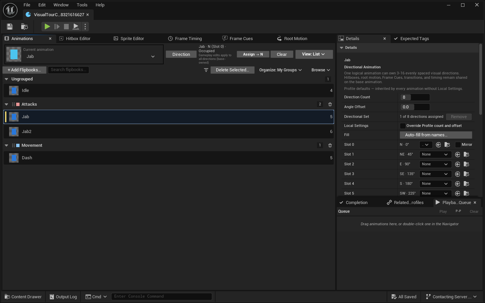
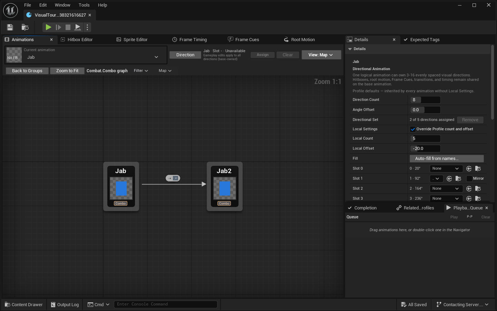
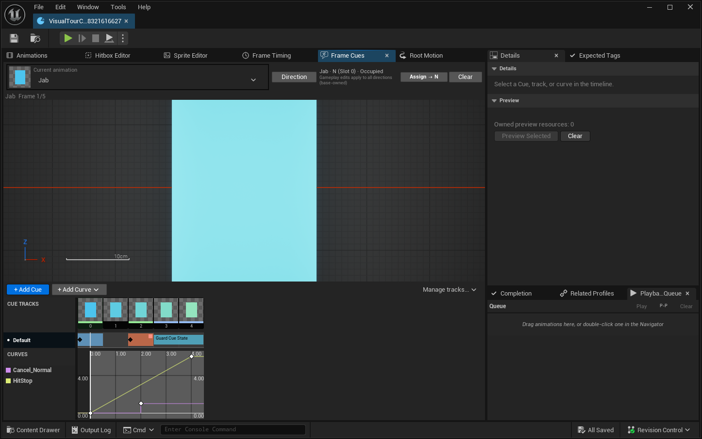
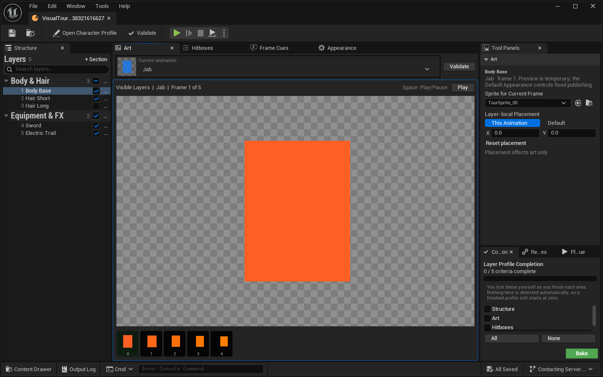
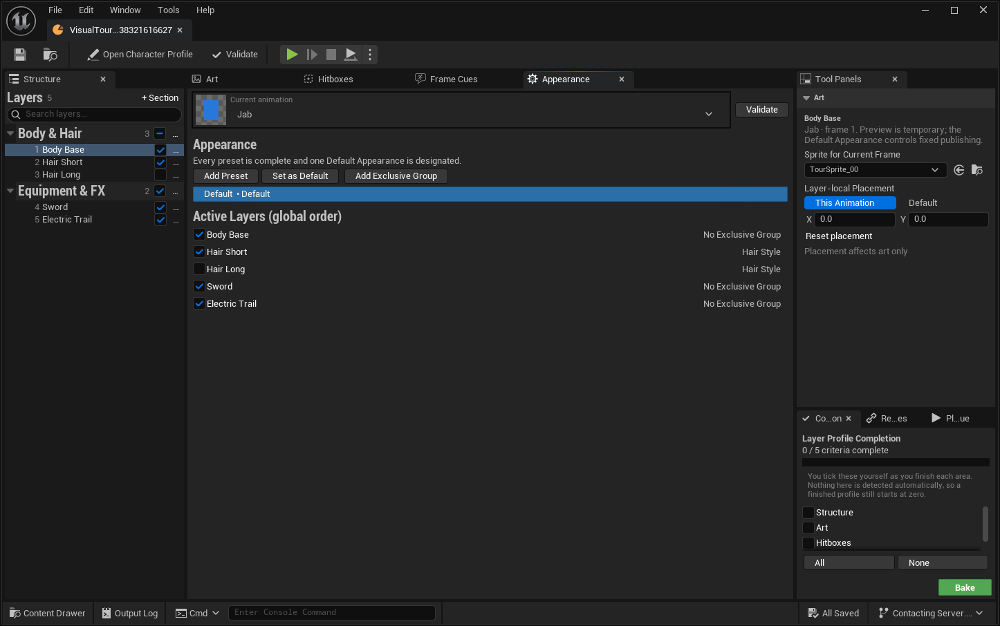

# Paper2D Plus

A character sprite pipeline for Unreal Engine's Paper2D. Purpose-built visual editors for flipbooks,
per-frame hitboxes, sockets, root motion, and frame timing; frame-anchored Cues with authorable Cue
Types; layered character appearance with runtime customization; Animation Map combo chains;
sprite-sheet extraction and Aseprite (`.ase`) import with diff-based reimport; Character Catalog,
Effect and Combat Profiles; and runtime debug visualization — instead of hand-editing data assets.

**Supported engines: UE 5.0 – 5.8.** Every release is built against all nine.

---

## Screenshots











## What it gives you

- **Character Profile** — one asset owning a character's animations, per-frame attack/hurt boxes,
  sockets, root motion, frame timing, curves, gameplay tags, and transitions. Each logical animation
  may also own a partial 3–16-slot multidirectional art set while keeping one base identity. The
  six-tool workspace (Animations, Hitbox, Sprite, Frame Timing, Frame Cues, Root Motion) shares one
  radial direction preview and authoring control.
- **Animation Map** — a node graph over your transitions. Author combo chains visually with Chain
  Start / Chain End markers, then query them from Blueprint by flipbook or by exact tags.
- **Frame Cues** — frame-anchored notifies with deterministic **Cue** and **Cue State** lifecycles
  and per-placement Frame Start / Frame End trigger edges. A Cue Type you author carries reflected
  payload **and** its own behavior (**On Cue Triggered**, or **On Cue Begin / Update / End**), which
  runs immediately before the listener broadcast; your receivers still own persistent state and
  every release. One built-in cue ships — **Spawn Flipbook Cue**, a one-shot effect with an offset
  you drag directly in the preview viewport — and every other cue is one you author, inside a
  deliberately narrow, cook-safe, network-aware envelope.
- **Character Layers** — layered art with stable layer IDs, exclusive groups, appearance presets,
  and two delivery modes: **Fixed / Baked** (compiles to ordinary flipbooks) or **Runtime
  Customizable** (swap skins, wearables, and cosmetic effects at runtime).
- **Sprite tooling** — sprite-sheet extraction with uniform-bounds detection, bulk multi-texture
  extraction, cross-sheet alignment, Aseprite (`.ase`) import and diff-based reimport, de-bake, and
  an Aseprite-style pixel draw tool for editing flipbook frames in place.
- **Character Catalog, Effect Profile, Combat Profile** — a project-wide character roster, a
  reusable visual-effect library, and an advisory utility-scoring layer for AI attack selection.
- **Optional multiplayer** — opt-in, intent-based appearance replication. Single-player is the
  default and costs nothing.

Runtime debug visualization is available through console variables
(`Paper2DPlus.ShowHitboxes 1`, `Paper2DPlus.ShowFrameData 1`) in PIE and development builds.

## Install

**From [Fab](https://www.fab.com/listings/7600dc00-077e-41db-9222-87f4240e26be)** (recommended) —
install through the Epic Games Launcher, then enable **Paper2D Plus** in *Edit → Plugins*.

**From source** — clone into your project's `Plugins/` directory:

```
YourProject/
  YourProject.uproject
  Plugins/
    Paper2DPlus/
```

Then right-click the `.uproject` → *Generate Visual Studio project files*, and build. A C++ project
is required to compile from source; Blueprint-only projects should use the Fab build.

> **Clone the whole repository.** `Config/` carries the CoreRedirects that keep assets authored in
> earlier versions loading, and `Shaders/` carries the global shaders the optional hybrid appearance
> compositor needs. A partial copy of `Source/` alone will load but will silently break redirects
> and composite rendering.

### Dependencies

Enabled automatically via the `.uplugin`: **Paper2D**, **GameplayTagsEditor**, **DataValidation**.

**PaperZD** is optional and detected at build time. With it installed you get sequence authoring and
flipbook→sequence resolution; without it the plugin compiles and runs with those paths disabled.
Paper2D Plus never takes ownership of playback decisions from PaperZD.

## Modules

| Module | Type | Purpose |
|---|---|---|
| `Paper2DPlus` | Runtime | Cooked character/profile data, Frame Cue dispatch, layer composition, appearance, catalog, effects, combat scoring, collision and root-motion helpers. |
| `Paper2DPlusBlueprintNodes` | UncookedOnly | Custom K2 nodes that expand to cooked runtime calls, so game Blueprints carry no editor-module dependency. |
| `Paper2DPlusEditor` | Editor | Every authoring surface: profile/layer/catalog/effect/combat editors, extraction and import pipelines, validation, and bake tooling. |

## Documentation

Start with the [Designer Guide](docs/designer-guide.md).

| Guide | Covers |
|---|---|
| [Designer Guide](docs/designer-guide.md) | The overall workflow and vocabulary. |
| [Multidirectional Animations](docs/directional-animations-guide.md) | Direction sets, the radial editor, Blueprint resolution, and the PaperZD boundary. |
| [Frame Cues](docs/frame-cues-guide.md) | Authoring Cue Types, their behavior, and writing receivers. |
| [Layer Authoring](docs/layer-authoring-guide.md) | Layers, presets, exclusive groups, baking. |
| [Runtime Appearance](docs/runtime-appearance-guide.md) | Runtime-customizable characters, hybrid rendering, crowd budgets. |
| [Character Catalog](docs/character-catalog-guide.md) | Project-wide roster, groups, companions. |
| [Effect Profile](docs/effect-profile-guide.md) | The visual effect library. |
| [Combat Profile](docs/combat-profile-guide.md) | Advisory attack scoring. |
| [Paper2DPlus and PaperZD](docs/paper2dplus-and-paperzd.md) | Where the boundary sits. |
| [Authority Contract](docs/authority-contract.md) | Per-API authority rules for networked projects. |
| [Testing and Release Verification](docs/testing.md) | The automation suite and the nine-engine release gate ladder, with recorded results. |

Contributors should read [ONBOARDING.md](ONBOARDING.md) for the architecture map and conventions.

## Validation

The plugin ships a validation pass that reports missing hitboxes, dangling transition targets,
duplicate tags, broken layer references, and cook-safety problems. Run it per asset from the editor
(**Asset → Validate Character Profile…**), across the Content Browser, through Unreal's Data
Validation, or headlessly via the `Paper2DPlusValidate` commandlet, which emits a machine-readable
JSON report.

How the plugin itself is verified — the automation suite and the release gate ladder run against
all nine engines before every release — is documented in
[Testing and Release Verification](docs/testing.md).

## Versioning

Semantic versioning. See [CHANGELOG.md](CHANGELOG.md) for what each release contains and
[RELEASING.md](RELEASING.md) for the rules that decide the version number.

Upgrading across a major version can require opening and resaving assets on the previous version
first — the changelog entry for that release always says so explicitly.

`EngineVersion` in the `.uplugin` pins a single engine because Fab requires one build per engine
version. It is **not** the supported range; the supported range is UE 5.0–5.8, stated above.

## License

MIT — see [LICENSE](LICENSE). You may use, modify, and redistribute this source,
including commercially, provided the copyright notice is retained.

## Support

- Discord: https://discord.com/invite/eJAyFthTNs
- YouTube: https://www.youtube.com/@infinitegameworks
- Fab: https://www.fab.com/listings/7600dc00-077e-41db-9222-87f4240e26be
  (or [open in the Epic Games Launcher](com.epicgames.launcher://ue/fab/product/22d3dcdd-b304-44e4-9c82-deca3ec09c45))

Built by Infinite Gameworks.
