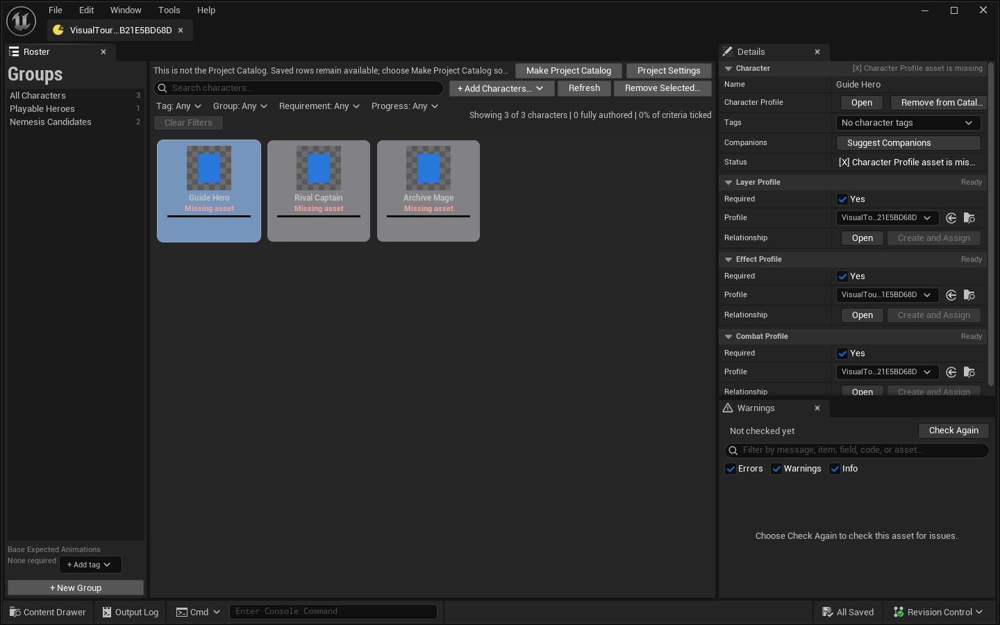
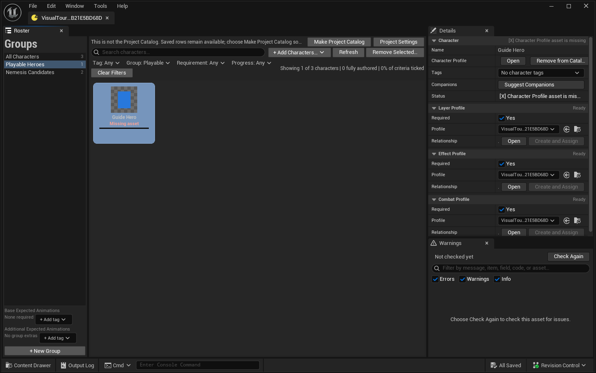

# Character Catalog Designer Guide

The Character Catalog is the project's saved, cook-safe directory of Character Profiles and their optional Character Layer Asset, Effect Profile, and Combat Profile companions. It organizes authored assets and exposes soft Blueprint queries. It does not own actor classes, spawn characters, or choose encounters.

The Catalog is a **directly manipulated roster**. Nothing scans your project and proposes rows: you add the characters you want with an explicit picker and remove the ones you do not, and both edits are ordinary undoable transactions. There is no discovery pass, no proposed-change review, and no automation command that rewrites the roster behind you.

## Workspace at a glance

Layout `CharacterCatalogAssetEditor_Layout_v4_GroupsRail` keeps the editor intentionally close to Unreal's standard content-browser-plus-Details shape:

- **Roster** is the default main tab and now owns grouping too. It is a splitter: a 20% **Groups rail** on the left and the 80% virtualized character-card grid on the right.
- Card faces deliberately match the Character Profile overview grammar: art, the designer-facing Character name, one compact line, and a thin authoring-progress meter. Selection uses a restrained accent instead of a full default selection wash.
- **Details** is docked in the upper-right and uses collapsible Unreal-style categories for the selected Character, its tags, requirements, and companion Profiles. **Remove from Catalog…** and **Suggest Companions** live here.
- **Warnings** is docked below Details. It shows the shared searchable, severity-filterable issue list with message, affected asset path, context, remediation, and an **Open** action. Double-clicking a warning performs the same navigation. The project-wide pass runs only after **Check Again**; it visibly advances once per roster row while resolving that row's named Profile and present companion assets.
- **Advanced** starts closed and contains the raw low-frequency properties for repair.

Search, filters, Project Catalog actions, and the **+ Add Characters…** / **Remove Selected…** commands remain compact rows above the cards rather than large headers. The Catalog may contain hundreds of characters; virtualization means it constructs only visible cards.

The card implementation is a hard shared contract: every Roster tile uses `SProfileCard`, its canonical 150x142 compact geometry, 64-pixel preview, shared padding/selection treatment, and the slab-free Content Browser tile-row style. Catalog-specific art, name, status, and progress meter are content inside that shell. Do not introduce a Catalog-only border, fill, metric, padding override, selection wash, or backing tile; a needed visual change belongs in `SProfileCard` and must be applied to every profile-card consumer.



The Groups rail keeps ordered roster editing beside the characters it organizes instead of on a separate tab:



Both images are regenerated by the designer visual tour (`scripts/run-paper2dplus-visual-tour.ps1`); do not hand-edit them.

The layout is intentionally one grammar at every supported editor width. At the 640x760 narrow release size, the Groups rail, card grid, upper-right Details, and lower-right Warnings remain usable; controls wrap or compress instead of turning into oversized headers. At 1920x1080 the same surfaces gain room without adding card-face metadata. A first-run empty Catalog keeps the rail, grid, Details, and Warnings locations stable and points designers to **Add Characters**. **Advanced** remains closed by default in every case.

Art loading uses that same visibility boundary. A resident Profile with a resident chosen/first Flipbook renders directly. For a saved unloaded row, tile generation asynchronously loads only the visible Character Profile and then its `ThumbnailFlipbookName` choice—or first referenced Flipbook when no choice is available. Off-screen rows start no art load. The editor retains at most 48 recently used Profile/Flipbook thumbnail loads in a true LRU: regenerating a visible tile refreshes its recency, and eviction releases its handles and strong references. Reopening the Catalog rebuilds that presentation cache, which is how a changed thumbnail source or an earlier terminal load failure is picked up. This is editor presentation only; it does not change the Catalog's runtime soft-query or loading contract.

## Establish the project Catalog

1. Create a **Paper2D+ Character Catalog** asset and open it.
2. In **Roster**, choose **Make Project Catalog**. Only this project-designated asset represents project-wide truth.
3. Add characters with **+ Add Characters…** (below).

The **Project Catalog** banner means Blueprint defaults, the Catalog pin picker, and project-wide Warnings resolve this asset. A non-project Catalog remains fully editable and inspectable but cannot represent project-wide truth until it is selected as the Project Catalog.

`Default Character Catalog` in **Project Settings > Plugins > Paper2DPlus** is the only Catalog setting. There are no configured character content roots: because intake is explicit, no folder list decides what belongs in the roster.

The default Catalog setting is a soft reference. It does not by itself guarantee cooking. The host project must register the `Paper2DPlusCharacterCatalog` Primary Asset type and a scan/cook rule that includes the chosen asset. The **Warnings** tab reports missing, editor-only, or production-blocked Asset Manager setup; choose **Check Again** after correcting it.

The unified project commandlet treats the configured default as a requirement, not merely another asset. An unfiltered run—or one filtered to `Catalog`—reports a stable Error when **Default Character Catalog** is unset, points at a missing object, or points at an asset of the wrong class. A valid Catalog or subclass is validated once through the normal shared adapter, with no duplicate synthetic row. Validation is read-only: it does not fill the setting, dirty settings/assets, or save.

## Add characters

**+ Add Characters…** is the only intake:

1. Choose **+ Add Characters…** above the card grid.
2. The picker is an ordinary Content Browser asset picker filtered to Character Profiles. It opens with **Show only profiles not in this Catalog** checked, so you see only real candidates; clear the checkbox to browse every Character Profile.
3. Select one or many profiles.
4. Double-click a profile, or choose **Add Selected**, to add them.

Everything selected is added in **one transaction**, so a single **Undo** reverses the whole batch. Null paths, repeats within the same selection, and profiles already saved in this Catalog are skipped rather than duplicated. The last added character is selected, so Details immediately shows the row you just created.

New rows are deliberately empty: no companion is assigned and no requirement is set. Assign companions in Details, or use **Suggest Companions** to fill the unambiguous ones.

## Remove characters, and it sticks

Removal is permanent, and nothing re-adds a removed character. There is no orphan record, no exclusion flag, and no rediscovery pass to fight.

Three equivalent routes, all multi-select aware:

- right-click a card and choose **Remove from Catalog…**;
- press **Delete** or **Backspace** with cards selected;
- choose **Remove Selected…**, which appears above the grid only while a selection exists.

Details also offers **Remove from Catalog…** beside the selected Character Profile field.

One confirmation covers the whole selection and states plainly that the Character Profiles and all companion assets will be kept. Confirming removes each saved entry **and every group membership** in one transaction, then advances selection to the nearest surviving visible neighbour so keyboard flow continues. Canceling changes nothing. Unreal **Undo** and **Redo** cover the complete removal.

Referenced assets are never deleted. Removing a character from the Catalog only says "this roster does not list it"; delete the Character Profile itself from the Content Browser if that is what you want.

## Read the authoring-progress meter

Each card shows real authoring progress — `N/M authored` plus a thin bar — summed from the designer's ticked completion checklist across the character's Character Profile **and each assigned companion** (Layer, Effect, Combat). Unassigned slots are not counted at all.

This replaces the old notion of "complete", which meant only "every *required* companion is assigned". Because all three Required flags default to off, every row used to read complete the moment it existed. Requirements now drive validation and the `Required missing` status only; the meter is the measure of authoring work.

Three things matter when reading it:

- **The criteria are manual ticks.** They come from the Completion panel in each asset's workspace. Nothing is inferred from content, so progress reflects what a designer has confirmed, not what the plugin guessed.
- **Progress refreshes on SAVE.** The roster reads hidden asset-registry metadata so it never loads your assets, and that metadata is written when the asset is saved. Tick criteria, then save the asset, and the card updates. The one exception: an asset that happens to be loaded already is read live, so a workspace you have open never contradicts the card in front of you.
- **"No checklist data" is an explicit state, never complete.** A character whose assets have not been saved since the progress contract shipped shows `Progress unknown` with a grey meter. A row without data is never presented as fully authored. If some assigned companions report and others do not, the tooltip says so and the total is marked incomplete.

The Character Profile contributes five criteria per animation (so its total scales with the animation count); Layer, Effect, and Combat each contribute the shared five-criteria profile checklist. An asset with genuinely nothing to author — a Profile with no animations, for example — reports zero of zero: it counts as answered but adds no denominator, so it can never fake completeness.

The roster summary above the grid reports `Showing X of Y characters`, how many characters are fully authored, the percentage of criteria ticked across the Catalog, and a count of rows with no checklist data.

## Work with the Roster

The card grid is a searchable/filterable projection. Combine:

- text search;
- character Tag;
- Group (the rail);
- requirement type;
- progress: **Fully authored**, **In progress**, or **No checklist data**.

Search and filters do not alter the current selection or Catalog data. **Clear Filters** returns to the complete projection. Warning severity and warning-text filtering live in the docked Warnings tab, where those controls operate on the current check results rather than on roster cards.

Each card shows one concise non-color line — the authoring meter's label, or a real problem when there is one, since a problem outranks progress. The full status set is:

- `Complete`
- `Optional missing`
- `Required missing`
- `Missing asset`
- `Warning`
- `Error`

`Missing asset` means the saved entry names a Character Profile that is no longer in the Asset Registry. The Warnings tab reports it as an Error; restore the asset or remove the row.

Select a card to edit requirements, tags, and companion Profiles in the docked Details tab. Every card in the grid is a live saved entry, so there is no preview-only state to apply first.

If no rows appear, clear filters and check the Groups rail scope, then use **+ Add Characters…**. An empty Catalog is empty because nothing has been added yet.

## Tags and Groups solve different problems

**Tags** are unordered classification data on each character row and support hierarchical/exact Blueprint queries.

**Groups** are explicit, ordered rosters with stable case-insensitive internal names and optional designer-facing labels. A character may belong to multiple groups.

Tags never add, remove, or reorder Group members. Use Tags for traits such as faction, biome, archetype, or difficulty; use Groups when authored membership/order itself matters, such as a boss roster or story cast.

## Declare expected animations

The Catalog also owns the project's expected-animation contract. The **Base Expected Animations** list applies
to every saved character. Select a real row in the Groups rail to edit that group's **Additional Expected
Animations**; selecting **All Characters** exposes only the base list. Both editors accept
`Paper2DPlus.Animation.*` tags and commit only explicit designer changes as ordinary undoable Catalog
transactions.

A character's expected set is the deduplicated union of the base list and the additions from every group it
belongs to. Renaming or reordering a group carries its additions because they live on the group itself;
deleting the group removes those additions with it. A character outside the Catalog has no Catalog expectation.

Coverage means at least one animation authored that exact tag in its own **Animation Tags** container.
Animation Group or combo-chain inheritance is reported as a near miss, never as covered, and a child tag such
as `Paper2DPlus.Animation.Combat.Heavy` does not satisfy the parent
`Paper2DPlus.Animation.Combat`. An animation may carry the expected tag alongside other descriptive tags; the
coverage result calls that superset out because exact-container lookup remains stricter. Reading or
recomputing coverage never adds tags, creates groups, or dirties the Catalog or Character Profile.
Open a roster character's Character Profile and use its **Expected Tags** tab to see every declared
expectation, including required-but-empty rows, then pick an animation or drag the expected tag onto a
Grid/List animation to author that exact tag additively.
For roster-wide triage, choose **Check Again** in the Catalog's Warnings tab. The same resolver reports one
Warning for each character/tag gap, including group-implied or chain-inherited near misses. Activating the
issue reveals that character's card; **Open** jumps to its Profile. Coverage gaps never become validation
Errors and never change the validation command's exit code.

### The Groups rail

The rail lists **All Characters** first, then every authored group in its authored order, each with its member count.

- **Scope the grid.** Select a rail row to filter the cards to that group's members. While a group is scoped, the grid is presented in the group's **authored member order**, not Catalog entry order — so what you reorder is what you see. Select **All Characters** to return to the whole roster.
- **Add members by dragging.** Drag one or many selected cards onto a rail row. Every dragged character joins that group in one transaction; a drop where everything is already a member says so and changes nothing. **All Characters** owns no membership and refuses the drop, as does a drag minted against a different Catalog.
- **Reorder groups by dragging.** Drag a rail row onto another rail row. Drops use insert-before semantics, so the indicator lands where you aimed it.
- **Reorder members by dragging.** While the grid is scoped to a group, drag one card onto another to move it within that group's authored order — insert-before again. This gesture is deliberately unavailable in the unscoped **All Characters** view, where card order is not authored member order.
- **Create a group.** Choose **+ New Group** or right-click the rail and choose **New Group**. You are asked for **one** thing: the label. A stable, case-insensitively unique internal name is derived from it (`Boss Fight` → `Boss_Fight`, with a numeric suffix if that name is taken). There is no second field to leave blank.
- **Rename a group.** Right-click a row and choose **Rename**, or rename inline. This changes the **display label only**; the internal `GroupName` stays stable, so Blueprint calls to `GetEntriesInGroup` keep working after a rename.
- **Delete a group.** Right-click and choose **Delete Group…**. The confirmation names the group and its member count, and states that the characters stay in the Catalog — only the grouping is removed.

Every rail mutation is a single undoable transaction. Runtime group queries preserve authored member order while skipping null, repeated, and out-of-Catalog entries.

## Understand one character row

The Character Profile soft path is the stable row identity. A row can carry:

- optional Character Layer Asset;
- optional Effect Profile;
- optional Combat Profile;
- per-companion Required flags;
- project-defined character Tags.

There are no editor-only link modes. An assignment is an assignment: whatever the row names is what the Catalog means, and validation checks it on that basis.

Required controls the `Required missing` status and the corresponding validation Error, nothing else. A missing optional companion is neutral. Runtime completion checks soft-path presence without loading companion assets.

### Suggest Companions

**Suggest Companions**, in the Details **Character** section, is the explicit convenience that replaces automatic reconciliation:

- it fills **only empty** Layer and Combat slots whose inward Character relationship resolves to **exactly one** asset;
- it never overwrites an assignment you authored;
- everything it does happens in one transaction, and a run that suggests nothing opens none;
- Effect is never suggested, because an Effect Profile has no inward Character relationship to resolve.

It reports what it declined to guess: slots with more than one match are listed as ambiguous for you to choose manually, slots whose companions carry older untagged relationship data are listed as legacy (resave those assets and try again), and slots with no candidate at all are listed as unmatched.

| Companion | Assignment source |
|---|---|
| Layer | Authored on the row; **Suggest Companions** can fill an empty slot from exactly one inward match |
| Combat | Authored on the row; **Suggest Companions** can fill an empty slot from exactly one inward match |
| Effect | Authored on the row only; the Effect Profile has no Character back-link |

An assigned companion that points at a different Character is reported as a mismatch; one that no longer exists as its class is reported as missing. Both fire for any non-null assignment.

**Create and Assign** is available for an empty slot. For Layer/Combat it creates the companion with its inward Character relationship and assigns it. For Effect it creates the library and assigns it to the row only.

## Commands and what they mutate

| Command | Meaning | Mutation |
|---|---|---|
| + Add Characters… | Add the picked Character Profiles as saved entries | Catalog only, one transaction |
| Remove from Catalog… / Delete / Remove Selected… | Remove the selected characters and their group memberships | Catalog only, one transaction; referenced assets are kept |
| Suggest Companions | Fill only unambiguous empty Layer/Combat slots | Catalog only, one transaction; nothing when there is nothing to fill |
| Groups rail edits | Create/rename/delete a group, add members, reorder groups or members | Catalog only, one transaction each |
| Check Again (Warnings) | Recheck the Catalog, expected-tag coverage, named companions, relationships, and cook readiness | None; explicitly loads named assets with one progress step per roster row |
| Save | Unreal's normal package save | Saves the current asset package |

Asset Registry events (a rename, a deleted Profile) only re-project the saved rows so status stays honest. They never add, remove, or repair an entry.

## Blueprint handoff

The runtime surface is unchanged by the direct-manipulation rework.

`GetDefaultCharacterCatalog` returns the configured Catalog as a typed soft reference and never synchronously loads it. A typical Blueprint flow is:

1. call `GetDefaultCharacterCatalog`;
2. use Unreal's **Async Load Asset** flow at a suitable loading boundary;
3. call pure instance queries on the loaded Catalog;
4. async-load only the Character/companion soft references actually needed;
5. let the game choose actor classes, encounters, and spawning.

For a designer-authored single choice, use the pure **Select Character from Catalog** node. Supply the
already-loaded Catalog object, then choose **Character** from the node's asset picker. The picker shows only
Character Profiles saved in that Catalog and the node returns the existing complete
`FPaper2DPlusCharacterCatalogEntry` plus **Found**. The Character pin remains a soft reference, and the lookup
expands to `FindEntryByCharacterProfile`, so it does not load the Character or any companion. A literal missing
Catalog or empty Character selection is a compile error; a literal selection removed from its Catalog is a
compile warning. When the Catalog pin is connected dynamically, the picker uses the configured project Catalog
for authoring choices and **Found** remains the runtime authority in case the supplied Catalog differs.

Catalog queries:

- `GetCatalogEntries`
- `FindEntryByCharacterProfile`
- `GetEntriesWithTag`
- `GetEntriesWithAllTags`
- `GetEntriesWithAnyTags`
- `GetCatalogGroupNames`
- `GetEntriesInGroup`
- `GetEntryCompletion`
- `GetCharacterCompletion`
- `ValidateCharacterCatalogAsset`

The query surface never loads referenced objects, spawns actors, mutates runtime Catalog state, or selects an encounter. The Roster's visible-row asynchronous art preview and the authoring-progress meter are editor-only and do not participate in these functions. Results preserve authored Catalog order. Null/duplicate Character rows are skipped with the first valid identity winning. Invalid or empty tag queries match nothing rather than everything.

These queries are O(N) or O(N*M). They are appropriate at loading, roster, encounter-planning, or cache-building boundaries; avoid scanning the full Catalog every tick.

## Validation and Warnings

Runtime structural validation reports errors for:

- missing Character identity;
- duplicate Character identity;
- a missing companion marked Required;
- missing or duplicate Group names.

It reports warnings for null, repeated, or out-of-Catalog Group members.

The editor **Warnings** tab additionally walks the **saved** entries and checks:

- **`Entry.MissingCharacterAsset`** (Error) — the entry's Character Profile is absent from the Asset Registry;
- **`Entry.MissingRequiredCompanion`** (Error) — a slot marked Required has no assignment;
- **`Relationship.Layer/Combat.ManualMismatch`** (Error) — an assigned companion points at a different Character;
- **`Relationship.Layer/Combat.ManualMissing`** (Error) — an assigned companion is missing or is the wrong class;
- **`Effect.DeletedAssignment`** (Error) — an assigned Effect Profile is missing or is the wrong class;
- **`Settings.InvalidAuthority`** (Error) — this Catalog is not the project-designated one;
- **`Cook.MissingRegistration`** (Error) — the host Asset Manager policy would not cook the configured Catalog;
- **`Coverage.MissingExpectedTag`** (Warning) — the named character does not author the expected Animation Tag; inherited/implied carriers remain gaps;
- **`Validation.AssetLoadFailed`** (Error) — a registry-present named Profile or companion could not load during the explicit pass, so its native checks could not run;
- **`Validation.DeferredDeepValidation`** (Info) — an assigned asset is present but not loaded, so its own native checks did not run. Open it and choose **Check Again** for the full result.

Choose **Check Again** to run that read-only, project-wide check; it does not run merely because the editor opened, selection changed, or another asset changed. Because coverage needs each named Profile and native validation also needs present companion assets loaded, the explicit pass shows one attributed progress step per saved roster row. Each issue includes remediation text and can focus the relevant row or field, open relevant settings, open its asset, or combine those actions. A `Group.*` issue brings the Roster to front and scopes the Groups rail to the affected group; a coverage issue selects and reveals its character card while **Open** targets that Profile. Checking never applies changes, repairs, saves, or dirties assets.

Codes retired with project discovery no longer exist and must not appear in reports or expectations: `Settings.InvalidContentRoot`, `Settings.MissingContentRoot`, `Discovery.StaleProjection`, `Discovery.UnsynchronizedSnapshot`, `Relationship.Layer/Combat.Ambiguous`, and `Relationship.Layer/Combat.LegacyUnknown`. Ambiguity and legacy uncertainty are now reported interactively by **Suggest Companions**, where a designer can act on them, instead of as standing warnings about a reconciliation pass that no longer runs.

Run the same release validation used by CI from the repository root:

```powershell
powershell -NoProfile -ExecutionPolicy Bypass -File scripts/validate-paper2dplus.ps1 `
  -JsonOutput Saved/Validation/Paper2DPlusValidate.json
```

The wrapper verifies `Paper2DPlusValidate` report schema 2 and preserves the commandlet's nonzero exit when any Error exists. `-Type` and `-Path` may narrow intentional local checks; use the unfiltered command for project release authority.

## Prove the configured Catalog cooks

The host-project proof has two separate artifacts:

1. Run `scripts/prepare-paper2dplus-character-catalog.py` inside Unreal's Python commandlet. It creates or safely synchronizes only `/Game/DataAssetLibrary/DA_Paper2DPlusCharacterCatalog`, refuses a wrong-class target, preserves designer-authored companion/requirement/tag data, and writes `Saved/Verification/Paper2DPlusCharacterCatalog.json`. Its host-settings check verifies exactly one thing: that **Default Character Catalog** points at the proof Catalog. There is no content-root requirement.
2. Perform a fresh loose Windows cook, then run `scripts/audit-paper2dplus-character-catalog-cook.ps1` against that cook and manifest.

Preparation manifest schema 2 records `catalog_object_path`, `catalog_class_path`, and `character_profile_class_path` in addition to the deterministic Profile inventory. The cook audit checks the exact configured Catalog object under the expected Catalog class and every manifested Character Profile under the expected Character Profile class. Object-path presence alone is insufficient: a same-path row under the wrong class fails. The audit also scans the loose cooked Catalog package and runtime registry for editor-only Catalog identities (`/Script/Paper2DPlusEditor`, `CharacterCatalogAuditService`). Schema 1 remains readable only for historical proof manifests; new release evidence must be schema 2.

Example preparation invocation:

```powershell
& 'Z:\Unreal\UE_5.8\Engine\Binaries\Win64\UnrealEditor-Cmd.exe' `
  "$PWD\LostRadiance.uproject" `
  "-ExecutePythonScript=$PWD\scripts\prepare-paper2dplus-character-catalog.py" `
  -unattended -nop4 -NoSplash
```

After the loose cook completes:

```powershell
powershell -NoProfile -ExecutionPolicy Bypass -File scripts/audit-paper2dplus-character-catalog-cook.ps1
```

Preparation, validation, and cook audit prove different things: preparation produces the reviewed source snapshot/manifest, validation proves authored relationships without mutation, and the cook audit proves runtime inclusion, exact class membership, and editor-only stripping.

Treat a Catalog as release-ready only when:

- every character the game needs has been added, and every character it does not need has been removed;
- this asset is the **Project Catalog**;
- every required companion is assigned;
- mismatched, missing, and deleted companion assignments are resolved;
- no row reports `Missing asset`;
- Catalog and companion validation has no errors;
- the authoring-progress meter tells a truthful story — no row you consider finished is still reading `Progress unknown`;
- the host project cook inspection is ready;
- the preparation manifest is schema 2 and the fresh loose-cook audit passes exact Catalog/Profile class membership.

## Migration from the discovery-era Catalog

An existing Catalog opens and works unchanged: entries, groups, requirements, and tags are the same data.

What is gone, and what to do instead:

- **Scan Project / Apply Changes** — add characters with **+ Add Characters…**. The picker's not-in-Catalog lens gives you the same "what is missing from the roster?" view, without a projection to review or apply.
- **Orphan Recovery** — removals are now permanent. Re-add a character through the picker if you change your mind; **Undo** covers it immediately after the fact.
- **Character content roots** — no folder list gates intake, so no setting needs maintaining.
- **Assignment modes (Automatic/Manual)** — every assignment is simply authored. Use **Suggest Companions** for the one-shot convenience Automatic used to provide.
- **The Groups tab** — grouping lives on the Roster's Groups rail.
- **The production Sync/save command** — there is no automation seam that rewrites the roster. Authoring the Catalog is a designer action in the editor; validation and the cook audit remain the automatable gates.

Older projects may still have Character relationships stored on companion assets. Those inward relationships feed **Suggest Companions** only. Do not use deprecated companion back-links as a second relationship authority: resolve the Catalog row, validate, and resave through the current workflow.

## Accessibility and troubleshooting

- Project Catalog state, row status, authoring progress, and warning severity use text and tooltips in addition to color; the progress meter always has a text label beside it.
- Primary buttons expose accessible labels. Activating a warning selects and reveals the intended roster row or scopes the Groups rail to the intended group, and opens an affected companion asset when applicable.
- If a Character Profile is missing from the Add picker, clear **Show only profiles not in this Catalog** — it is probably already in the Catalog.
- If a card reads `Progress unknown`, open each of that character's assets, tick its Completion criteria, and **save**. Registry progress data refreshes on save.
- If a card's progress looks lower than expected, check the tooltip for assigned companions that reported no checklist data.
- If a card reads `Missing asset`, its Character Profile is gone from the registry: restore the asset or remove the row.
- If a group scope shows characters in an order you did not author, confirm you are scoped to the group and not to **All Characters** — only the scoped grid is member-ordered, and only it accepts card-on-card reordering.
- If a group rename appears not to take effect in Blueprint, that is by design: rename changes the label only, and `GetEntriesInGroup` keys off the stable internal name.
- If **Suggest Companions** leaves a slot empty, read its message: ambiguous means choose manually, legacy means resave the companion, unmatched means no candidate exists.
- If the Effect picker for a Character is unscoped, verify the Catalog row's Effect assignment and the Effect Profile's saved library.
- If packaged Blueprint lookup returns no default Catalog, fix the host Asset Manager scan/cook policy and choose **Check Again** before shipping.
- If project validation reports `MissingAuthority`, `MissingAuthorityAsset`, or `InvalidAuthorityClass`, correct **Default Character Catalog** first; creating an unrelated valid Catalog elsewhere does not satisfy the configured-authority gate.

See [Effect Profiles](effect-profile-guide.md) and [Combat Profiles](combat-profile-guide.md) for companion authoring.
