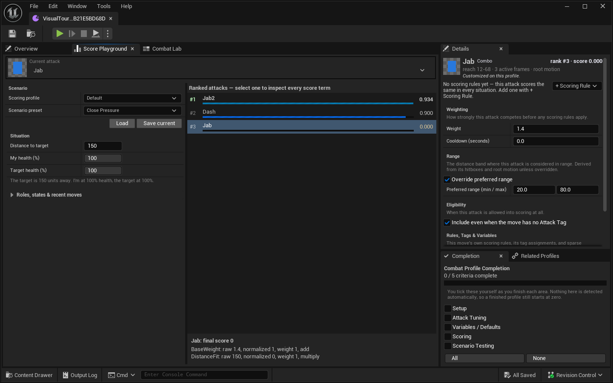
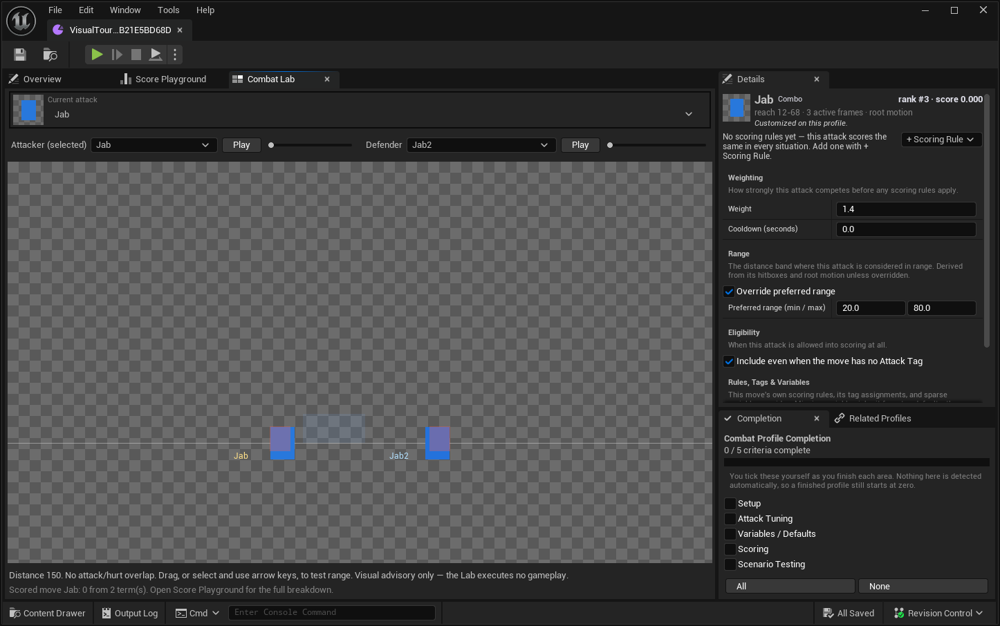

# Combat Profile Designer Guide

A Combat Profile is a utility-AI design layer beside one Character Profile. It derives physical attack facts from the Character Profile, adds tactical tuning, and returns ranked advice with an explanation. It never plays an animation, applies damage, enforces cooldown, or chooses authoritative game state.

## What belongs where

| Character Profile owns | Combat Profile derives or owns |
|---|---|
| Flipbooks and canonical move identity | A derived attack catalog for eligible moves |
| Attack/hurt hitboxes and frame damage | Effective reach, including hitbox extent and authored root motion |
| Root motion and active-frame data | Read-only physical facts shown in the attack inspector/Lab |
| Animation/tag mappings | Attack-tag defaults and role tags |
| Pure From-to transition map | Per-move utility tuning and score considerations |
| Playback decisions remain in game/PaperZD | Ranked options, best decision, weighted pick, and score breakdown |

Do not duplicate reach, frame damage, or active frames into a Combat Profile. Fix physical facts in the Character Profile, then refresh the derived views.

## Workspace at a glance

Layout `CombatProfileAssetEditor_Layout_v9_CharacterGrammar` uses the same shape as the Character Profile editor, so if you know one you know the other. Along the top are the tools — **Overview**, **Score Playground**, and **Combat Lab** — and each one carries the same compact **current attack** control the Character editor uses for animations: art preview, searchable name, and Up/Down to step through attacks while it has focus. On the right, **Details** shows the selected attack and stays with you when you switch tools, so you can tweak a rule in Details and watch its rank change in Score Playground without going anywhere. **Completion** and **Related Profiles** sit underneath Details.

Unreal's standard top toolbar can launch and control PIE without leaving the Combat Profile. Those Play/Pause/Resume/Step/Stop controls operate the project session; Combat Lab's play/pause remains a separate local advisory preview.

**Overview** is where attacks live: a status header (Character link, plain-language counts, **Generate Missing**, **Validate**), a **Scoring Variables** strip that stays collapsed until you add one, and the attack card browser. Search matches move names and attack tags. Cards show reach and mark the moves you've customized with a dot.

**Details** leads with read-only facts (reach, active frames, damage, root motion) and a live rank + score badge for the current Score Playground situation, lists every scoring rule that applies to the attack with its provenance (all attacks / its tag / this move), then offers **+ Scoring Rule** templates, Weighting/Range/Eligibility rows, this move's own rules/tags/variable overrides, and **Revert to inherited defaults**.

**Score Playground** puts everything you configure in one left-hand column: **Scenario** (which scoring profile does the ranking, which saved preset to **Load** or **Save current** onto) above **Situation** (distance and both health values), with roles, states, and recent moves in a collapsed area below. Those rows use the same name/value column as the rest of the plugin's tool panels, so dragging the divider on any one of them moves them all. The ranked attack list on the right takes all the height it can, and the score explanation underneath sizes to the selected move's terms rather than holding open an empty box.

**Completion** is a manual checklist on every profile. You tick each area yourself as you finish it — nothing is detected from asset content, so a fully authored profile still reads 0 / 5 until you start ticking.

**Variables**, **Tag Defaults**, **Scoring Profiles**, and **Scenario Presets** are closed by default and open as extra tools; low-frequency raw/future fields stay in Advanced data. **Validate** opens the shared modeless issue panel; there is no permanent Validation tab.

Attack cards have no Combat-specific visual exception: every tile uses `SProfileCard`, its canonical 150x142 compact geometry, 64-pixel preview, shared padding/selection treatment, and the slab-free Content Browser tile-row style. Move name, tag leaf, reach badge, customization dot, tooltip, click behavior, virtualization, and thumbnail LRU remain Combat-owned content/behavior inside that shell. Cards stay quiet about defaults — the weight appears only when it differs from 1.0, and the ● dot only on moves customized in this profile. Do not add a local border, fill, size, padding override, selection wash, or backing tile; change `SProfileCard` and every consumer together if the shared grammar must evolve.

## First setup

1. Create or assign a Combat Profile from the Character Catalog, or create one directly.
2. Open it and link its **Character Profile** in **Overview**.
3. In the Character Profile, make sure intended attacks participate in attack tag mappings. Untagged moves are excluded unless an explicit attack row enables **Include When Not Tagged**.
4. Choose **Generate missing attack rows** when you want explicit tuning rows for all eligible attacks. Generation is additive and can be limited to missing rows.
5. Select an attack card. Inherited attacks use tag defaults until you choose **Customize this attack**.
6. Tune only what differs: weight, roles, preferred range override, recent-use inputs, variables, and considerations.
7. Exercise representative situations in **Score Playground**, then inspect visual reach/collision in **Combat Lab**.
8. Save useful Score Playground/Lab inputs as **Scenario Presets**, then choose **Validate** when you want the shared issue panel.

### Empty states

- **Link a Character Profile first:** no physical facts can be derived without it.
- **No attacks:** tag attack moves in the Character Profile. For a deliberately untagged move, add a row in the **Details (Advanced)** tab and enable **Include When Not Tagged**.
- **No variables:** choose **+ Add Variable**, then assign a unique `Paper2DPlus.Combat.Var.*` tag and type.
- **No scored attacks:** verify the linked profile, attack inclusion, selected scoring profile, and current context. A zero score can be a valid consequence of a multiplicative gate.
- **No breakdown:** select a ranked attack in Score Playground.

## Understand the scoring layers

Every eligible attack starts from its effective Base Weight and automatic distance fit. The scorer can then apply:

1. desired-role matching from the runtime context;
2. a fixed recent-move penalty when `RecentMoves` contains the move;
3. global considerations from the selected Scoring Profile;
4. considerations inherited from the move's Attack Tag defaults;
5. considerations authored on the move-specific row.

Each consideration reads one source, normalizes it with an operation, applies a weight, and either multiplies or adds it to the score.

Sources:

- distance to target;
- self health percent;
- target health percent;
- desired role tags;
- target state tags;
- custom Bool variable;
- custom Float variable.

Operations:

- Range Window;
- Linear;
- Linear Inverse;
- Bool Equals;
- Tag Any;
- Tag All.

Multiplicative rules are gates: a normalized zero makes the current score zero. Additive rules are bonuses. Score Playground lists every raw value, normalized value, weight, combine mode, and final score so designers do not have to infer why a move ranked where it did.

The **+ Scoring Rule** menu provides grounded starting templates such as preferred range, low-target-health finisher, cautious-when-hurt, target-state gate, and custom variable gates. Adding a rule to an attack that still inherits everything customizes it first (one undo step). Templates are starting values, not hidden behavior; inspect the resulting row.

## Variables and precedence

Variable identity is a Gameplay Tag under `Paper2DPlus.Combat.Var.*`, not the display label. Considerations reference the same tag.

Bool and Float variables are current scoring sources. The value resolver uses this precedence:

1. Runtime Context value;
2. move-specific Attack Option value;
3. Attack Tag default value;
4. Combat Profile global value.

Variable maps are sparse overrides. An absent row means “inherit from the next scope”; delete an override row to return to inheritance. Changing Variable Definitions keeps compatible explicit overrides and removes values for definitions that no longer exist. Use the guided rename path so references move with the tag. Other declared value types are retained for schema/general use but are not read by the current custom Bool/Float consideration sources.

Profiles saved by the earlier dense-map implementation keep every serialized value during load so an engine upgrade cannot silently change scoring. Overview then shows **Review old values**. That explicit, undoable action removes only rows exactly equal to the value they currently inherit; values that would change behavior stay explicit. Review and save those profiles once to adopt the sparse schema.

## Preferred range and physical reach

The derived forward range fuses the Character Profile's attack hitbox X extent with per-frame root-motion offset. That is physical reach. A Tag Default or move row may override **Preferred Range** for tactical spacing without rewriting physical data.

Combat Lab lets you position an attacker and defender, choose moves, play/pause, and inspect attack/hurt overlap. Click a participant to select it and focus the canvas, then drag or use the arrow keys: arrows move 10 units, **Shift+Arrow** moves 1 unit, and **Ctrl+Arrow** moves 50 units. Its boxes and sprites use the same frame pivot, fractional-pivot correction, facing mirror, scale, and accumulated root-motion projection as runtime collision; edits to the selected move reevaluate immediately. It is explicitly visual and advisory: it executes no gameplay and applies no damage. Score Playground is the full score-explanation surface.

## Scenario Presets

A Scenario Preset stores the runtime scoring Context, selected Scoring Profile name, and optional Combat Lab participant moves/positions/selection. Playback clocks remain transient editor state.

Use presets for reproducible questions such as:

- Which attack wins at 160 units when the target is low health?
- Does an airborne target-state gate remove grounded options?
- Do two role-tag variants produce the expected ordering?

Loading the same preset and scoring profile should reproduce the same ranked scores. Weighted selection is random-stream driven and is a separate question from deterministic ranking.

## Blueprint handoff

Add a `Combat Profile Component` when an actor needs convenient target context and a persistent random stream.

Useful component calls:

- `MakeTargetContext`
- `ScoreAttackOptions`
- `GetCombatDecision`
- `PickWeightedCombatAttack`
- `GetCombatDecisionForTarget`
- `ResetCombatRandomStream`

The Combat Profile asset also exposes `BuildAttackCatalog`, `ScoreAttackOptions`, `GetCombatDecision`, and `PickWeightedCombatAttack` for systems that do not need an actor component. `GetActorCombatDecision` is available on the shared Blueprint library.

Recommended game flow:

1. Build the authoritative runtime context from server-owned positions, health, tags, recent moves, and runtime variables.
2. Ask for ranked options or a decision.
3. Check `bHasGoodAttack`, Best Move, desired range, and score/breakdown.
4. Apply project-specific gates the profile does not own: cooldown timers, resources, line of sight, current state-machine legality, replication, and interruption rules.
5. Ask the game/PaperZD state machine to play the selected move.

`GetCombatDecision` returns the highest-ranked option. `PickWeightedCombatAttack` advances an `FRandomStream` and chooses among ranked weights. The component broadcasts `OnCombatDecisionUpdated` after decision calls, but that delegate is advisory and does not replicate or play a move.

For networked AI, make the gameplay decision on authority and replicate the resulting gameplay state through the game. Combat Profile assets/components have no decision replication layer of their own.

## Current inert or advisory fields

Do not assume a visible field is an active driver:

- `CooldownSeconds` is carried into derived attack data but the scorer does not enforce a timer. The game must enforce it.
- `bUseWeightedSelection` is serialized on a Scoring Profile but is not read by current scoring/decision functions. Call the explicit deterministic or weighted Blueprint function you intend.
- `TransitionOutcomeRules` and `CancelCategories` are dormant foundation data. Nothing reads them at runtime.
- `Cancel_<Category>` curves and the `HitStop` curve remain authoring conventions without an automatic Combat transition/hit-stop driver. Game code calls hit-stop explicitly and owns transition legality.

These fields are shown in the editor's Advanced/Future data area so they are not mistaken for shipped behavior.

## Validation

Choose **Validate** to open the shared modeless issue panel. It can stay beside the editor while issues are inspected, but it consumes no default workspace space.

Errors include:

- missing Character Profile;
- empty or duplicate variable tags;
- attack rows with no move identity;
- duplicate attack rows for the same move;
- dangling, ambiguous, or foreign move bindings.

Warnings include:

- an attack/tag-default tag that is not mapped by the Character Profile;
- a Tag Default with no Attack Tag;
- an unnamed Scoring Profile.

An Info issue identifies an inert tuning row whose move is untagged and has not enabled **Include When Not Tagged**.

Validation is read-only. **Generate missing attack rows** and guided edits are explicit undoable mutations. The attack browser, Score Playground refresh, and Combat Lab inspection derive views without rewriting physical Character Profile data.

## Migration and troubleshooting

- Legacy free-form variable names are folded into registered `Paper2DPlus.Combat.Var.*` tags when possible. Unresolvable or duplicate identities remain validation issues.
- A legacy dense variable snapshot is preserved until **Overview > Review old values** is chosen. The review removes behavior-neutral duplicate rows only and is fully undoable.
- Canonical move identity is the flipbook soft path. Old name-only rows are refreshed only when the Character Profile match is unique; ambiguous matches are not guessed.
- If an attack shows **Inherited**, it intentionally has no move-specific tuning row. Choose **Customize this attack** only when it needs an exception.
- If a score unexpectedly reaches zero, inspect the first multiplicative term with normalized value zero.
- If reach looks wrong, fix Character Profile hitboxes/root motion rather than masking it with a preferred-range override.
- If Score Playground and gameplay differ, compare the full runtime context and confirm the game is applying its extra gates after scoring.

See [Character Catalogs](character-catalog-guide.md) for companion assignment and project audit.
