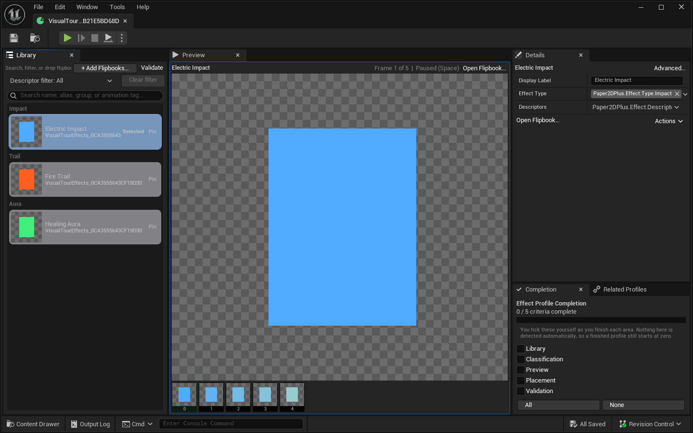

# Effect Profile Designer Guide

An Effect Profile is an ordered visual library of Paper Flipbooks. It helps designers curate, classify, preview, and filter effect art. It does not execute effects, own spawn placement, or identify entries by a custom effect name.

## The ownership rule

| Data | Owner |
|---|---|
| Effect flipbook membership | Effect Profile |
| Primary Type and optional Descriptors | Effect Profile library row |
| Character-to-Effect-Profile association | Character Catalog row |
| Exact effect Flipbook used by one Cue default or placement | An ordinary variable on the designer-authored Cue Type |
| Offset, rotation, scale, facing rule, and tint for one placement | Fields on the Cue Type you author |
| Spawning, pooling, attachment, lifetime, damage, and gameplay effect behavior | Project Blueprint/C++ |

The flipbook's object path is the library identity. `Display Label` is presentation only. Reordering or relabeling a row does not change what asset it represents.

## Loading and Blueprint contract

Effect Profile rows store their exact Flipbooks as internal soft references. Loading the Effect Profile itself loads no effect art. The stored soft field is never Blueprint-visible; Blueprint callers continue to work with ordinary `UPaperFlipbook` object outputs and do not need to load soft references themselves. The raw `Effects` array remains read-only in Blueprint for saved-graph compatibility, but breaking one row routes through a native hard-object projection and resolves only that row.

The query determines the loading boundary:

- `GetEffectEntryCount`, validation, and normalized-path membership checks load no Flipbooks;
- `GetEffectEntryByIndex` loads only that row and retains its hard projection internally for the native Break Struct boundary;
- `GetEffectFlipbookByIndex` loads and returns only that row's Flipbook;
- breaking a row obtained from the compatibility `Effects` array loads only that row and exposes the old hard `EffectFlipbook` pin;
- Type/Descriptor array queries select rows from metadata before loading, then load only the matches;
- `GetEffectFlipbooks` deliberately loads every unique non-null library member because asking for the complete hard-object array requires every result to be resident.

During normal playback, the Character Profile Component warms and retains only the current animation's cue art before frame traversal. The base Cue implementation structurally discovers every scalar soft Paper Flipbook variable, resolved or unresolved, without a marker or library declaration. The Frame Cues editor mirrors that current-animation warm set, so dispatch and Slate paint never become hidden per-frame loading points. (Through v7.0.0 the native Spawn Effect Cue held its Flipbook in soft storage behind `ResolveSpawnSettings` and a deprecated `Get Effect Flipbook` getter; that class was deleted in v8.0.0 along with the other five built-in Cue types.)

## Workspace at a glance

Layout `EffectProfileAssetEditor_Layout_v5_NarrowLibrary` deliberately follows the Character Profile visual grammar instead of presenting another dashboard:

- **Library** occupies the left 24% for search, intake, selection, and order.
- **Preview** occupies the center 50% and uses the same compact thumbnail frame strip as the Character tools.
- **Details** occupies the upper part of the right 26% for the selected library row.
- **Completion** and **Related Profiles** share the lower right sibling-tab stack. **Advanced Details** starts closed, and Validation opens only when requested in a shared modeless panel.

Unreal's standard top toolbar can launch and control the project's PIE session directly from the Effect Profile. Its Play/Pause/Resume/Step/Stop controls are separate from the selected effect's local Preview playback.

Every Effect Library item uses `SProfileCard` for the same rounded shell, clipping, padding, and selection accent as Character, Catalog, and Combat, and its preview size comes from the shared 64-pixel metric. The horizontal Library arrangement and Effect-specific label/tag/pin content live inside that shell; they are not an exception to it. Do not add an Effect-only border, fill, padding, selection treatment, hard-coded preview size, or row backing. If the shared grammar needs to change, change `SProfileCard` and all consumers together.

The Preview surface does not autoplay and has no separate play/stop toolbar, loop control, or draggable playback slider. Click Preview or a frame to give it keyboard focus. Clicking does not draw a focus outline — mouse focus is silent so scrubbing never leaves a standing highlight — while keyboard focus shows a visible outline to confirm the target. Press **Space** to toggle play/pause, use **Left/Right** to seek adjacent frames, and use **Home/End** to jump to the first/last frame. Clicking or keyboard-seeking a frame pauses playback, updates the same selected cell, and scrolls that cell into view. When frames exist, the compact status and accessible summary report the selected effect, frame position, and playing/paused state; otherwise they name the distinct no-frame state.

The three-column ownership remains visible and usable at the 640x760 narrow release size, then expands at 1920x1080; it does not turn into a separate mobile-style dashboard. A first-run empty asset keeps all three regions in place: Library presents **This visual library is empty** with add/drop guidance, Preview has no selection and a zero-frame strip, and the right Details panel says **No effect selected**. This prevents the first action from moving when the first row is added.

## Build a visual library

1. Create a **Paper2D+ Effect Profile** asset and open it.
2. In **Library**, choose **Add Existing Flipbooks...** and select one or many Paper Flipbooks, or drag Content Browser flipbooks anywhere into the panel.
3. The intake report names added, duplicate, and rejected assets. Duplicates are skipped; the first accepted flipbook becomes selected when the library was empty.
4. Select a row. **Preview** shows the current sprite and Character-style key-frame strip. Click Preview, then use **Space**, **Left/Right**, and **Home/End**; click a frame to pause/seek, or choose **Open Flipbook…**.
5. In **Details**, optionally set a display label, choose one primary Type, and add zero or more Descriptors.
6. Use **Move Up** / **Move Down** when authored order matters to a consumer.
7. Choose **Validate** to open the shared modeless issue panel, then resolve all errors plus intentional migration warnings.

Removing a row removes library membership only. The editor does not search for or rewrite Cue defaults or placements that already store that Flipbook directly.

### Empty library

The empty state offers the same two valid starts: **Add Existing Flipbooks...** or Content Browser drag/drop. If an item is rejected, confirm it is a `UPaperFlipbook`; sprites, textures, and unrelated assets are not accepted as library members.

## Classify effects with tags

Every classified row should have exactly one strict child of `Paper2DPlus.Effect.Type`, such as:

- `Paper2DPlus.Effect.Type.Weapon`
- `Paper2DPlus.Effect.Type.Projectile`
- `Paper2DPlus.Effect.Type.Impact`
- `Paper2DPlus.Effect.Type.Aura`
- `Paper2DPlus.Effect.Type.Trail`
- `Paper2DPlus.Effect.Type.Environment`

Descriptors are optional, additive dimensions under `Paper2DPlus.Effect.Descriptor`, with built-in examples such as Fire, Ice, Electric, Poison, and Healing. Projects may extend both subtrees in Gameplay Tag settings.

Use hierarchy to specialize within a dimension and a container to combine dimensions. For example, an impact can have the Type `Impact` and Descriptors `{Fire, Healing}`. Do not encode a display folder or character name as identity.

The Library search matches labels, asset names/paths, and tag text. The Descriptor filter requires all selected descriptors; **Clear filter** restores the unfiltered view. Filtering never changes the current selection.

## Assign the library to a character

The Character Catalog is the only active Character-to-Effect-Profile relationship authority.

1. Open the project Character Catalog and select the Character row.
2. In its Effect Profile companion section, choose or **Create and Assign** the Effect Profile.
3. Mark the Effect companion **Required** only if that character cannot be considered complete without it.

Effect assignments are Catalog-owned. Unlike Layer and Combat automatic relationships, the Effect asset has no active Character back-link. Creating an Effect Profile from the Catalog writes only the Catalog row.

If the Catalog is not project-authoritative or the Character is still a pending discovery row, first choose **Make Project Catalog** and run **Sync Reviewed**. See [Character Catalogs](character-catalog-guide.md).

## Use the library independently

Effect Profiles are curated, queryable libraries; they are not a special Cue-variable type. Use the Effect Profile editor to classify and preview art, and use the asset's Blueprint queries when game or editor code needs library membership. A Cue Type author adds ordinary variables—including a scalar soft Paper Flipbook when frame-zero warming is needed—and implements the spawn/pooling behavior directly.

This boundary keeps both systems honest:

- runtime Cue dispatch never resolves an Effect Profile or Catalog;
- changing a Catalog assignment or library membership never rewrites an existing Cue;
- Cue variables carry only the values their behavior needs;
- Effect Profile Type/Descriptor tags continue to classify library rows and drive explicit queries.

## Blueprint queries

On an Effect Profile asset:

- `GetEffectEntryCount`
- `GetEffectEntryByIndex`
- `GetEffectFlipbookByIndex`
- `GetEffectFlipbooks`
- `ContainsEffectFlipbook`
- `GetEffectFlipbooksByType`
- `GetEffectFlipbooksByDescriptor`
- `GetEffectFlipbooksWithAllDescriptors`
- `GetEffectFlipbooksWithAnyDescriptors`
- `ValidateEffectProfileAsset`

Equivalent `UPaper2DPlusBlueprintLibrary` wrappers use the `GetEffectProfile...` naming; `GetEffectEntryCount` and `GetEffectFlipbookByIndex` are intentionally asset methods only. Results are ordered, skip null rows, and deduplicate by normalized flipbook object path with the first authored row winning. Type/Descriptor queries support hierarchical matching by default and exact matching when requested. `GetEffectEntryByIndex` retains its loaded result internally, and the native row break exposes the old hard `EffectFlipbook` output for compatibility; the underlying soft field remains internal in both cases.

These queries return visual membership. They do not spawn effects, supply placement defaults, or infer which ordinary Cue variable represents effect art.

## Validation

**Validate** opens the shared modeless panel; Validation does not occupy a permanent workspace tab. The panel is read-only and navigates issues back to the relevant row/field.

Errors:

- a library row has no flipbook;
- a stored Flipbook path is missing or resolves to an asset of the wrong class;
- Asset Registry discovery has not yet confirmed a stored Flipbook path (Info until discovery completes);
- the same flipbook appears more than once.

Warnings:

- no primary Type is assigned;
- Type is not a strict child of `Paper2DPlus.Effect.Type`;
- a Descriptor is outside `Paper2DPlus.Effect.Descriptor`;
- a retained legacy category still awaits explicit remapping.

Row badges provide text/tooltips as well as color. Use **Advanced Details** only for raw compatibility payload or uncommon asset fields; normal authoring belongs in Library, Preview, and the right-side Details panel. Open Validation only when checking or resolving issues.

Validation follows Asset Registry redirectors to their destination without loading either asset. The row badges and shared issue panel refresh when a referenced path changes and when Registry discovery completes, so a provisional Info result cannot remain cached as clean or hide a later missing/wrong-class error.

## Migration and legacy data

Older assets may contain effect names, profile-owned spawn placement, old categories, Character links, or built-in Spawn Effect Cues that reference a profile/name pair. **As of v8.0.0 the Cue-side half of this list no longer converts:** the six built-in Cue classes and every legacy Cue migration were deleted, so such placements are inert and must be re-authored as Cue Types. Effect Profile row behavior is unchanged. Current behavior is:

1. The Effect Profile migrates compatible membership to flipbook identity without clearing retained source data.
2. A compatible old category becomes a current Type/Descriptor when it already fits the taxonomy. Otherwise it is kept visibly in **Legacy Category Awaiting Remap**.
3. ~~A profile/name-based Spawn Effect Cue bakes the old effective result into direct flipbook/placement fields exactly once when it can resolve.~~ **Removed in v8.0.0** with the built-in Cue class and its migration.
4. Historical Cues that migrated under v7 stopped consulting the profile/name source at runtime and preview; v8 performs no new Cue migration.
5. An unresolved legacy Cue source remains retained legacy data; it is not silently stamped as direct empty data.
6. Deprecated Character links on the Effect asset are relationship payload for transition only. The Character Catalog is the current authority.
7. Existing hard Effect row values deserialize into the same-name internal soft field on UE 5.0–5.8, and Effect Profile schema v2 marks its owning packages for resave. (The native Cue's compatibility property, its effect-reference schema v1, and its `DirectDataVersion` were deleted with the class in v8.0.0.)
8. Saved Blueprint reads remain hard-object reads: old Effect-row Break Struct nodes convert to the native break boundary and the raw `Effects` array remains read-only. Compile, resave, and recook upgraded Blueprint packages once; no graph should expose or ask you to load a soft reference. (Graphs that read the deleted Spawn Effect Cue's properties break outright — there is no compatibility getter left to call.)

For a pending category, assign the intended Type and Descriptors, verify search/query results, then clear the retained legacy category in Advanced Details. For an unresolved Cue, manually reproduce the effective values in a designer-authored Cue Type before clearing anything; v8 has no Cue migration to rerun.

The old name/category resolver functions remain deprecated compatibility APIs. New Blueprints should use flipbook membership and Type/Descriptor queries.

## Accessibility and troubleshooting

- Library, Preview, and right-side Details regions expose descriptive accessible text.
- Add/drop results name duplicates and incompatible assets rather than relying on a toast color.
- A row's warning/error state has a text tooltip and a modeless Validation target.
- Preview keyboard help names **Space**, **Left/Right**, and **Home/End**; frame cells are direct pause-and-seek targets, so there is no hidden slider-only interaction.
- A visible focus outline identifies when Preview owns the keyboard. Seeking keeps the selected frame visible, and focused frame/playback changes publish the same live summary to assistive technology.
- Preview reports **No effect selected**, **Selected flipbook has no frames**, **Current frame has no sprite**, or **Current sprite has no texture** as distinct states.
- If an explicit Character-scoped Effect query has no results, verify the project Catalog, Character row, Effect assignment, and saved library membership in that order.
- If a query returns fewer items than the raw array, check null/duplicate rows and exact-vs-hierarchical tag matching.

See [Frame Cues](frame-cues-guide.md) for direct placement and runtime reception.
